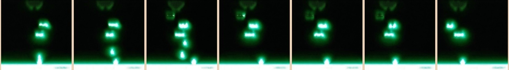
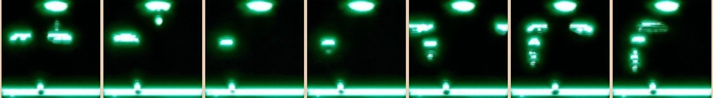

# Visual_analogies_for_RL_transfer_Learning

## Acknoweledgments:
The UNIT GAN code is heavily based on the code of the [oficial imlpementation](https://github.com/mingyuliutw/UNIT)
And the RL code is heavily based on the code of [rl_a3c_pytorch](https://github.com/dgriff777/rl_a3c_pytorch)

## Requierments:
1. Install the following apps:
```
sudo apt-get install go, swig, libjpeg-turbo8-dev
```
2. Install python 3.5.
3. Use pip:
```
pip install -r requierments.txt
```
4. Install pytorch [for detailed explanation](http://pytorch.org/).
5. ```pip install setproctitle```

## Datasets
To Download the data used to create the Mappers:
1. Download the zip files from [here](https://drive.google.com/drive/folders/1B4_n0X0s5ZV3yOhHX2tjJN1G2hX2WpEy?usp=sharing)
2. Unzip the files in datasets/games/

## Training the Mapper
To train the mapper:
```
cd src
python cocogan_train.py --config ../exps/unit/<conf>.yaml --log ../logs/<log_name>
```
### Mapper Images
Source | Target
:--------|-----------:
 | 
 | 
 | 
 | 
 | 
 | 
 | 
 | 

## Gaining the Base Network for the Distilation Method
To pre-train the distialation network:
```
cd rl_a3c_pytorch
```
1. Create the data:
```
 python ./disco_gym_eval.py --model_env <source enviroment> --env <target enviroment> --use_convertor True --convertor 1  --a2b <direction a and b are difined in the config file> --config <config file of the conversion> --weight <mapper file>  --load-model-dir <directory of the source model>  --transform-action   --keep-images True --num-episodes 100  --labels-file <path to create the labewl file>  --images-dir <directory to save the data>  --blurr (--cuda)
```
2. Train:
```
python pretrain_main.py --experiment_name <name of  the experiment> --epochs 300 --batch-size 16 --gradient-clip 40  --lr 0.0001 --num_of_targets <number of actions in the source game> --dataset-file <path to the label file (from previous)> --loss-type cross_entropy --save_dir <save directory for the model> --log_dir <directory of the logs>   --root ./ --sec-len 10
```

## Transfer Learning Experiments
1. Distilation:
```
python main_perceptual.py --env <Target enviroment> --workers <number of threads> --save-model-dir <directory to save the model> --load-model-file <model trained to mimic the source>  --max-episode-length 10000 --load-conv --experiment-name <name> --log-dir <log directory> --cuda --gpu-ids <list of availabel gpus> --amsgrad True --workers <number of threads>
```
2.
```
python ./main_perceptual.py --model_env <source> --env <target> --use_convertor --a2b <direction> --config <conf file> --weight <mapper>  --experiment-name <name> --save-model-dir <save dir for the model> --workers <number of threads for the training>  --max-episode-length 10000 --log-dir <log directory> --deterministic --co-train-expantion  --per-process-convertor --cuda --gpu-ids <list of gpus> --blurr --pre-workers <number of threads for the pretrain phase> --pretrain_iterations <number of pretrain iterations (usualy 7M is enough)>
```
3.
```
python ./main_perceptual.py --model_env <source> --env <target> --use_convertor --a2b <direction> --config <conf_file> --weight <cmapper> --save-model-dir <save dir for the model>  --experiment-name <name> --workers <numbre of workers for the source training (usualy 6 times the number of workers for the target)> --test-workers <number of test workers>  --max-episode-length 10000 --log-dir <log> --deterministic --co-train-expantion  --per-process-convertor --cuda --gpu-ids <list of gpus> --blurr --pre-workers <number of target workers>
```
